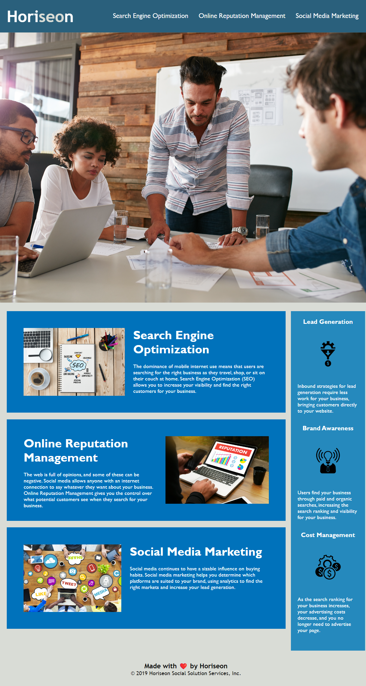

# ida-profile-portfolio

## Description

A website offering services and strategies for business' success with emphasis on SEO, online reputation management and social media marketing. 
Semantic elements were used for those in need of accessibility.

## Installation

N/A

## Usage

Any details about the services offered are below by scrolling down the page and just access the necessary service by clicking the link at the top of the page.

[

## Credits

Photo by <a href="https://unsplash.com/@onkysf?utm_content=creditCopyText&utm_medium=referral&utm_source=unsplash">Yusuf Onuk</a> on <a href="https://unsplash.com/photos/a-group-of-sunflowers-pGpbccZU3vk?utm_content=creditCopyText&utm_medium=referral&utm_source=unsplash">Unsplash</a>
  
  
  <a target="_blank" href="https://icons8.com/icon/41083/nokia-3310">Nokia 3310</a> icon by <a target="_blank" href="https://icons8.com">Icons8</a>
  

## License

MIT License. You can also refer to the license in the repository.
